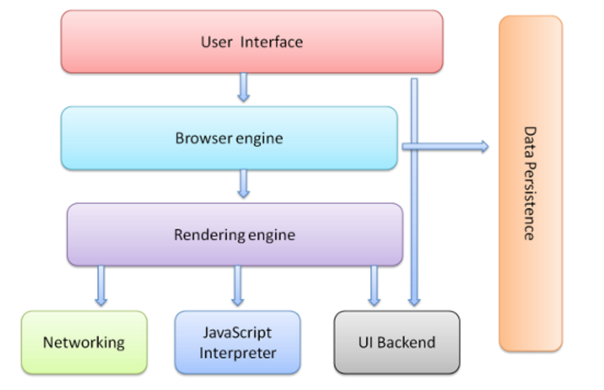
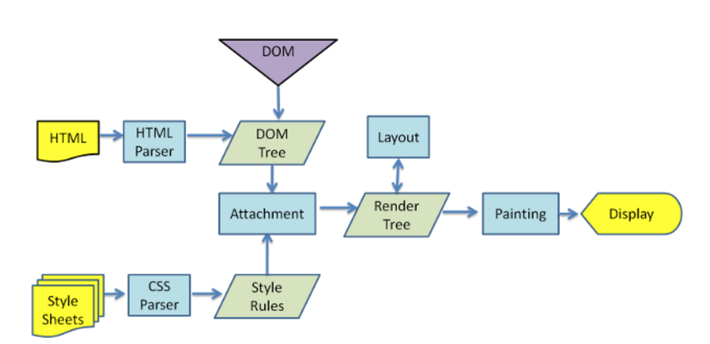
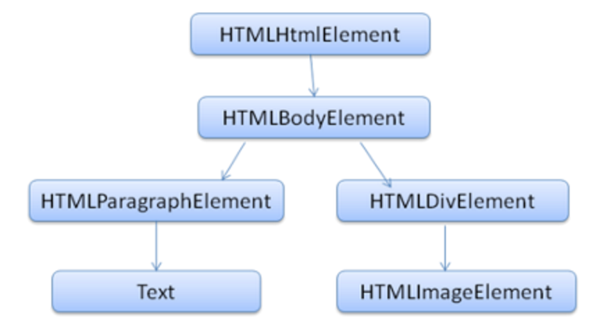
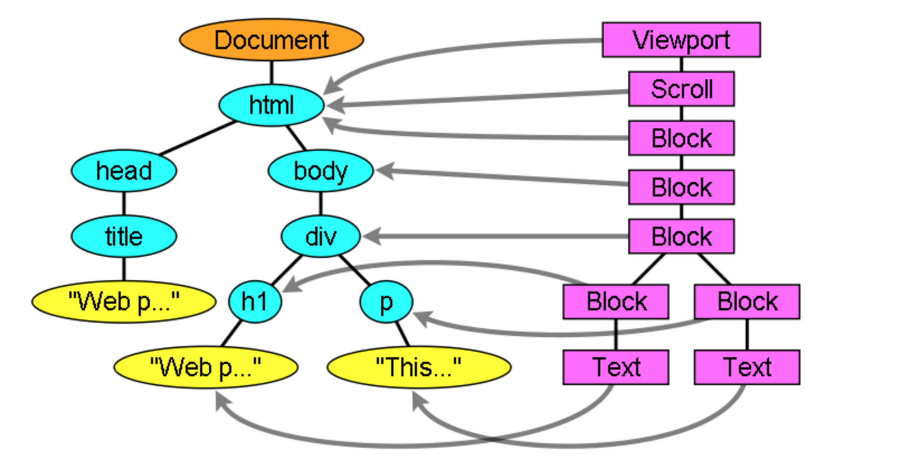

# 浏览器的工作原理
## 浏览器的主要构成
1. 用户界面——包括地址栏、后退/前进按钮、书签目录等，也就是你所看到的除了用来显示你所请求页面的主窗口之外的其他部分
2. 浏览器引擎——用来查询及操作渲染引擎的接口
3. 渲染引擎——用来显示请求的内容，例如，如果请求内容为html，它负责解析html及css，并将解析后的结果显示出来
4. 网络——用来完成网络调用，例如http请求，它具有平台无关的接口，可以在不同平台上工作
5. UI后端——用来绘制类似组合选择框及对话框等基本组件，具有不特定于某个平台的通用接口，底层使用操作系统的用户接口
6. JS解析器——用来解释执行JS代码
7. 数据存储——属于持久层，浏览器需要在硬盘中保存类似cookie的各种数据，HTML5定义了web database技术，这是一种轻量级完整的客户端存储技术



### 渲染引擎
````
渲染引擎的职责就是渲染，即在浏览器窗口中显示所请求的内容。

默认情况下，渲染引擎可以显示html、xml文档及图片，它也可以借助插件（一种浏览器扩展）显示其他类型数据，
例如使用PDF阅读器插件，可以显示PDF格式，将由专门一章讲解插件及扩展，
这里只讨论渲染引擎最主要的用途——显示应用了CSS之后的html及图片。
````
#### 主流程
渲染引擎首先通过网络获得所请求文档的内容，通常以8K分块的方式完成。<br>
下面是渲染引擎在取得内容之后的基本流程：
```解析html以构建dom树->构建render树->布局render树->绘制render树```

````
渲染引擎开始解析html，并将标签转化为内容树中的dom节点。
接着，它解析外部CSS文件及style标签中的样式信息。
这些样式信息以及html中的可见性指令将被用来构建另一棵树——render树。

Render树由一些包含有颜色和大小等属性的矩形组成，它们将被按照正确的顺序显示到屏幕上。

Render树构建好了之后，将会执行布局过程，它将确定每个节点在屏幕上的确切坐标。
再下一步就是绘制，即遍历render树，并使用UI后端层绘制每个节点。

值得注意的是，这个过程是逐步完成的，为了更好的用户体验，
渲染引擎将会尽可能早的将内容呈现到屏幕上，并不会等到所有的html都解析完成之后再去构建和布局render树。
它是解析完一部分内容就显示一部分内容，同时，可能还在通过网络下载其余内容。
````


##### HTML解析器
HTML解析器的工作是将html标识解析为解析树。

输出的树，也就是解析树，是由DOM元素及属性节点组成的。 DOM是文档对象模型的缩写，它是html文档的对象表示，作为html元素的外部接口供js等调用。

树的根是“document”对象。 DOM和标签基本是一一对应的关系，例如，如下的标签：
````
<html>
    <body>
        <p>
          Hello DOM
        </p>
        <div></div>
    </body>
</html>
````
将会被转换为下面的DOM树： 


和html一样，DOM的规范也是由W3C组织制定的。 这里所谓的树包含了DOM节点是说树是由实现了DOM接口的元素构建而成的，浏览器使用已被浏览器内部使用的其他属性的具体实现。

##### 脚本解析
###### 脚本
`web的模式是同步的`，开发者希望解析到一个script标签时立即解析执行脚本，并阻塞文档的解析直到脚本执行完。 `如果脚本是外引的，则网络必须先请求到这个资源——这个过程也是同步的，会阻塞文档的解析直到资源被请求到。` 这个模式保持了很多年，并且在html4及html5中都特别指定了。 开发者可以将脚本标识为defer，以使其不阻塞文档解析，并在文档解析结束后执行。 `Html5增加了标记脚本为异步的选项，以使脚本的解析执行使用另一个线程`。
###### 渲染树的构造
当Dom树构建完成时，浏览器开始构建另一棵树——渲染树。 渲染树由元素显示序列中的可见元素组成，它是文档的可视化表示，构建这棵树是为了以正确的顺序绘制文档内容。

每个渲染对象用一个和该节点的css盒模型相对应的矩形区域来表示， 正如css2所描述的那样，它包含诸如宽、高和位置之类的几何信息。 盒模型的类型受该节点相关的display样式属性的影响

###### 渲染树和DOM树的关系
渲染对象和Dom元素相对应，但这种对应关系不是一对一的，`不可见的Dom元素不会被插入渲染树`，例如head元素。 另外， `display属性为none的元素也不会在渲染树中出现(visibility属性为hidden的元素将出现在渲染树中）`。

还有一些Dom元素对应几个可见对象，它们一般是一些具有复杂结构的元素，无法用一个矩形来描述。 例如，select元素有三个渲染对象——一个显示区域、一个下拉列表及一个按钮。 同样，当文本因为宽度不够而折行时，新行将作为额外的渲染元素被添加。 另一个多个渲染对象的例子是不规范的html，根据css规范，一个行内元素只能仅包含行内元素或仅包含块状元素， 在存在混合内容时，将会创建匿名的块状渲染对象包裹住行内元素。

一些渲染对象和所对应的Dom节点不在树上相同的位置，例如，浮动和绝对定位的元素在文本流之外， 在两棵树上的位置不同，渲染树上标识出真实的结构，并用一个占位结构标识出它们原来的位置。


##### CSS2可视模型
###### 定位策略
这里有三种策略：

1. normal－对象根据它在文档的中位置定位，这意味着它在渲染树和在Dom树中位置一致，并根据它的盒模型和大小进行布局
2. float－对象先像普通流一样布局，然后尽可能的向左或是向右移动
3. absolute－对象在渲染树中的位置和Dom树中位置无关

- static和relative是normal，absolute和fixed属于absolute。
- 在static定位中，不定义位置而使用默认的位置。其他策略中，作者指定位置——top、bottom、left、right。
- Box布局的方式由这几项决定：box的类型、box的大小、定位策略及扩展信息（比如图片大小和屏幕尺寸）。

###### Box类型
````
Block box：构成一个块，即在浏览器窗口上有自己的矩形
Inline box：并没有自己的块状区域，但包含在一个块状区域内
block一个挨着一个垂直格式化，inline则在水平方向上格式化。
Inline盒模型放置在行内或是line box中，每行至少和最高的box一样高，
当box以baseline对齐时——即一个元素的底部和另一个box上除底部以外的某点对齐，行高可以比最高的box高。
当容器宽度不够时，行内元素将被放到多行中，这在一个p元素中经常发生。
````
###### 定位 Position

- Relative

相对定位——先按照一般的定位，然后按所要求的差值移动。

- Floats

一个浮动的box移动到一行的最左边或是最右边，其余的box围绕在它周围。

- Absolute和Fixed

这种情况下的布局完全不顾普通的文档流，元素不属于文档流的一部分，大小取决于容器。

Fixed时，容器为viewport（可视区域）。

注意－fixed即使在文档流滚动时也不会移动。