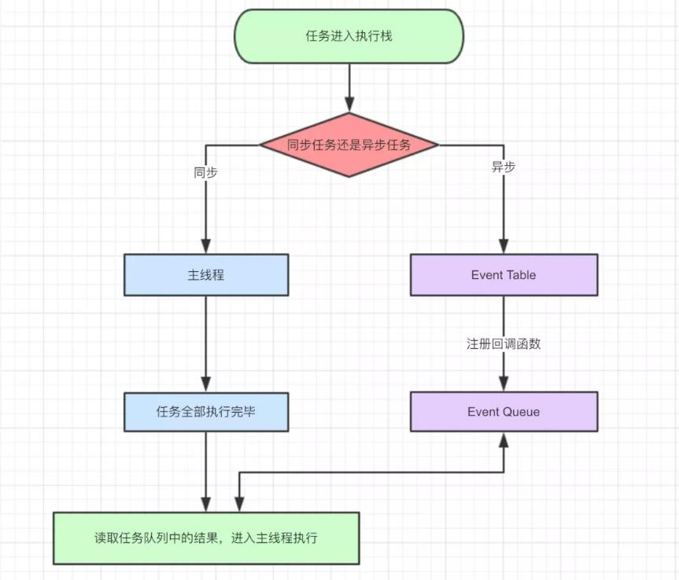

# JavaScript运行机制

- JS是单线程语言
- Event Loop是JS的执行机制

1. JS为什么是单线程的?
````
JS最初被设计用在浏览器中,那么想象一下：
如果浏览器中的JS是多线程的,那么现在有2个进程,process1 process2,
由于是多进程的JS,所以他们对同一个dom,同时进行操作
process1 删除了该dom,而process2 编辑了该dom,同时下达2个矛盾的命令,浏览器究竟该如何执行呢?
````
2. JS为什么需要异步?
````
如果JS中不存在异步,只能自上而下执行,如果上一行解析时间很长,那么下面的代码就会被阻塞。
对于用户而言,阻塞就意味着"卡死",这样就导致了很差的用户体验
所以,JS中存在异步执行。
````
3.  JS单线程又是如何实现异步的呢?
````
是通过的事件循环(event loop)
````
## 任务
- 所有任务可以分成两种，一种是同步任务（synchronous），另一种是异步任务（asynchronous）。 <br>
- 同步任务指的是，在主线程上排队执行的任务，只有前一个任务执行完毕，才能执行后一个任务； <br>
- 异步任务指的是，不进入主线程、而进入"任务队列"（task queue）的任务，只有"任务队列"通知主线程， 某个异步任务可以执行了，该任务才会进入主线程执行。<br>
- 当我们打开网站时，网页的渲染过程就是一大堆同步任务，比如页面骨架和页面元素的渲染。而像加载图片音乐之类占用资源大耗时久的任务，就是异步任务。

<br>
1. 同步和异步任务分别进入不同的执行"场所"，同步的进入主线程，异步的进入Event Table并注册函数。
2. 当指定的事情完成时，Event Table会将这个函数移入Event Queue。
3. 主线程内的任务执行完毕为空，会去Event Queue读取对应的函数，进入主线程执行。
4. 上述过程会不断重复，也就是常说的Event Loop(事件循环)。


具体来说，异步执行的运行机制如下。（同步执行也是如此，因为它可以被视为没有异步任务的异步执行。）
````
（1）所有同步任务都在主线程上执行，形成一个执行栈（execution context stack）。
（2）主线程之外，还存在一个"任务队列"（task queue）。只要异步任务有了运行结果，就在"任务队列"之中放置一个事件。
（3）一旦"执行栈"中的所有同步任务执行完毕，系统就会读取"任务队列"，看看里面有哪些事件。
    那些对应的异步任务，于是结束等待状态，进入执行栈，开始执行。
（4）主线程不断重复上面的第三步。

````

````
let data = [];
$.ajax({
    url:www.javascript.com,
    data:data,
    success:() => {
        console.log('发送成功!');
    }
})
console.log('代码执行结束');
````

上面是一段简易的ajax请求代码：

1. ajax进入Event Table，注册回调函数success。
2. 执行console.log('代码执行结束')。
3. ajax事件完成，回调函数success进入Event Queue。
4. 主线程从Event Queue读取回调函数success并执行。

## Event LOOP
- 主线程从"任务队列"中读取事件，这个过程是循环不断的，所以整个的这种运行机制又称为Event Loop（事件循环）。
````
    console.log(1)
    
    setTimeout(function(){
        console.log(2)
    },0)

    console.log(3)
````

运行结果是: 1 3 2

也就是说,setTimeout里的函数并没有立即执行,而是延迟了一段时间,满足一定条件后,才去执行的,这类代码,我们叫异步代码。

所以,这里我们首先知道了JS里的一种分类方式,就是将任务分为: 同步任务和异步任务

按照这种分类方式:JS的执行机制是

- 首先判断JS是同步还是异步,同步就进入主进程,异步就进入event table
- 异步任务在event table中注册函数,当满足触发条件后,被推入event queue
- 同步任务进入主线程后一直执行,直到主线程空闲时,才会去event queue中查看是否有可执行的异步任务,如果有就推入主进程中
- 以上三步循环执行,这就是event loop

所以上面的例子,你是否可以描述它的执行顺序了呢?
`
- console.log(1) 是同步任务,放入主线程里
- setTimeout() 是异步任务,被放入event table, 0秒之后被推入event queue里
- console.log(3) 是同步任务,放到主线程里

当 1、 3在控制条被打印后,主线程去event queue(事件队列)里查看是否有可执行的函数,执行setTimeout里的函数

### 宏任务和微任务
- 事实上,按照异步和同步的划分方式,并不准确。

而准确的划分方式是:

- macro-task(宏任务)：包括整体代码script，setTimeout，setInterval
- micro-task(微任务)：Promise，process.nextTick
<br>
按照这种分类方式:JS的执行机制是

- 执行一个宏任务,过程中如果遇到微任务,就将其放到微任务的【事件队列】里
- 当前宏任务执行完成后,会查看微任务的【事件队列】,并将里面全部的微任务依次执行完
````
 setTimeout(function(){
     console.log('定时器开始啦')
 });
 
 new Promise(function(resolve){
     console.log('马上执行for循环啦');
     for(var i = 0; i < 10000; i++){
         i == 99 && resolve();
     }
 }).then(function(){
     console.log('执行then函数啦')
 });
 
 console.log('代码执行结束');
 ````
 尝试按照刚学的执行机制,去分析例2:
 ````
 首先执行script下的宏任务,遇到setTimeout,将其放到宏任务的【队列】里
 
 遇到 new Promise直接执行,打印"马上执行for循环啦"
 
 遇到then方法,是微任务,将其放到微任务的【队列】里
 
 打印 "代码执行结束"
 
 本轮宏任务执行完毕,查看本轮的微任务,发现有一个then方法里的函数, 打印"执行then函数啦"
 
 到此,本轮的event loop 全部完成。
 
 下一轮的循环里,先执行一个宏任务,发现宏任务的【队列】里有一个 setTimeout里的函数,执行打印"定时器开始啦"
 ````
 所以最后的执行顺序是【马上执行for循环啦 --- 代码执行结束 --- 执行then函数啦 --- 定时器开始啦】
 
 ## 定时器
 除了放置异步任务的事件，"任务队列"还可以放置定时事件，即指定某些代码在多少时间之后执行。 这叫做"定时器"（timer）功能，也就是定时执行的代码。
 
 定时器功能主要由setTimeout()和setInterval()这两个函数来完成，它们的内部运行机制完全一样， 区别在于前者指定的代码是一次性执行，后者则为反复执行。
 
 setTimeout()接受两个参数，第一个是回调函数，第二个是推迟执行的毫秒数。
 ````
 setTimeout(function(){console.log(1);}, 0);
 console.log(2);
 ````
 上面代码的执行结果总是2，1，因为只有在执行完第二行以后，系统才会去执行"任务队列"中的回调函数。
 
 - 总之，setTimeout(fn,0)的含义是，指定某个任务在主线程最早可得的空闲时间执行，也就是说，尽可能早得执行。
 - 它在"任务队列"的尾部添加一个事件，因此要等到同步任务和"任务队列"现有的事件都处理完，才会得到执行。
 
 HTML5标准规定了setTimeout()的第二个参数的最小值（最短间隔），不得低于4毫秒，如果低于这个值，就会自动增加。 在此之前，老版本的浏览器都将最短间隔设为10毫秒。 另外，对于那些DOM的变动（尤其是涉及页面重新渲染的部分），通常不会立即执行，而是每16毫秒执行一次。 
 
 需要注意的是，setTimeout()只是将事件插入了"任务队列"，必须等到当前代码（执行栈）执行完，主线程才会去执行它指定的回调函数。 要是当前代码耗时很长，有可能要等很久，所以并没有办法保证，回调函数一定会在setTimeout()指定的时间执行。